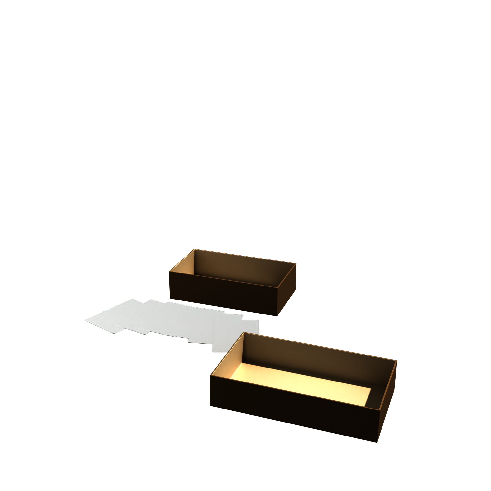

# blender-card-layout-tools

A collection of Blender Python scripts for generating and arranging physical card game components — boxes, playing cards, and studio layouts — directly inside Blender's Script Editor.

Built and used in a real card game production pipeline. Scripts are designed to be simple, self-contained, and easy to adapt for any card or box product.


---

## Scripts

| Script | Description |
|---|---|
| `box_generator.py` | Generates a two-piece box (lid + bottom) with procedural cardboard materials, bevel, solidify, and optional inner lip |
| `card_importer.py` | Creates 3D playing cards from front/back image files, with rounded corners and correct UV mapping. Falls back to placeholder materials if no images are provided |
| `layout_table_row.py` | Arranges cards in a straight row on the floor, with auto-framing for the active camera |
| `layout_fan.py` | Arranges cards in a hand-held fan arc, with configurable spread angle and radius |
| `scene_setup.py` | Sets up a Cycles studio scene: shadow-catcher floor, 3 area lights, 2 camera presets, target empty |

---

## Preview



---

## Requirements

- Blender 3.x or 4.x
- No external add-ons required
- All scripts run from Blender's built-in **Script Editor**

---

## Quick Start

### 1. Studio scene
Run `scene_setup.py` first to set up lights, cameras, and the shadow-catcher floor.

### 2a. Generate a box
Open `box_generator.py`, adjust the dimensions at the top of the file, and run it.

```python
LID_OUTER    = (211.0, 119.0, 45.0)   # Width, Depth, Height in mm
BOTTOM_OUTER = (206.0, 114.0, 55.0)
```

### 2b. Import cards
Set `CARD_FOLDER` in `card_importer.py` to a folder containing your card images:

```
0001 Questions.jpg
0001 Answers.jpg
0002 Questions.jpg
0002 Answers.jpg
...
```

Leave `CARD_FOLDER = ""` to generate placeholder cards without any images.

### 3. Apply a layout
Run `layout_table_row.py` or `layout_fan.py` to position the cards.
Both scripts auto-frame the active camera.

---

## Box Generator — key parameters

```python
LID_OUTER    = (211.0, 119.0, 45.0)  # mm
BOTTOM_OUTER = (206.0, 114.0, 55.0)  # mm
WALL_THICKNESS = 2.0                 # mm
BEVEL_RADIUS   = 0.9                 # mm
DISPLAY_MODE   = "CLOSED"            # "CLOSED" or "OPEN"
ADD_LIP        = True                # inner alignment skirt
```

To use your own texture, replace the procedural material in `make_cardboard_material()` with an image texture node connected to Base Color.

---

## Card Importer — key parameters

```python
CARD_WIDTH_CM      = 7.0
CARD_HEIGHT_CM     = 10.0
THICKNESS_MM       = 0.5
CORNER_RADIUS_MM   = 3.0
OUTPUT_MODE        = "SINGLE"   # "SINGLE" or "DOUBLE"
EDGE_STYLE         = "WHITE"    # "WHITE" or "CARDBOARD"
```

---

## Fan Layout — key parameters

```python
FAN_SPREAD_DEG = 40.0   # total fan angle
FAN_RADIUS_CM  = 28.0   # arc radius
TILT_X_DEG     = 0.0    # tilt toward camera
```

---

## Project context

These scripts were developed as part of the production workflow for [Play That Song!](https://playthatsong.de) — a music quiz card game. The tools automate the 3D visualization of physical products for marketing and print preparation.

---

## License

MIT — free to use and adapt for your own projects.

---

## Author

[Yevhenii Pinchuk](https://www.linkedin.com/in/yevhenii-pinchuk-08b3283ba)